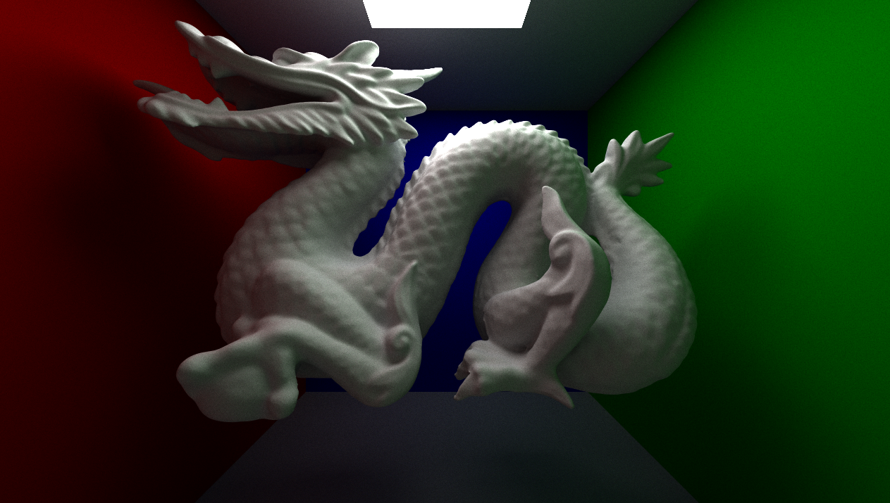
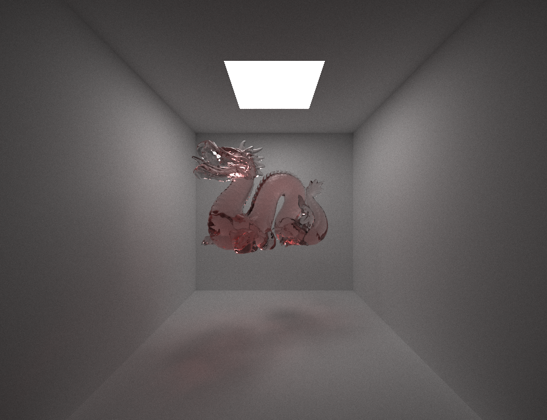

# Path-tracer

This is a path-tracer written using C++ and OpenGL. It can render diffuse, reflective and transparent materials. The acceleration structure used is a threaded BVH (binary tree).

## Some scenes:

## Sources:
- [Implementing a practical rendering system using GLSL - Toshiya Hachisuka](https://cs.uwaterloo.ca/%7Ethachisu/tdf2015.pdf)
- [Efficiency Issues for Ray Tracing - Brian Smits](https://www.cse.chalmers.se/edu/year/2018/course/TDA362/EfficiencyIssuesForRayTracing.pdf)
- [How to build a BVH](https://jacco.ompf2.com/2022/04/13/how-to-build-a-bvh-part-1-basics/)
- [PathTracer Part 2 - Henry Xu](https://henryzxu.github.io/pathtracing-p2/)
- [Raytracing Reflection, Refraction, Fresnel, Total Internal Reflection, and Beer’s Law](https://blog.demofox.org/2017/01/09/raytracing-reflection-refraction-fresnel-total-internal-reflection-and-beers-law/)